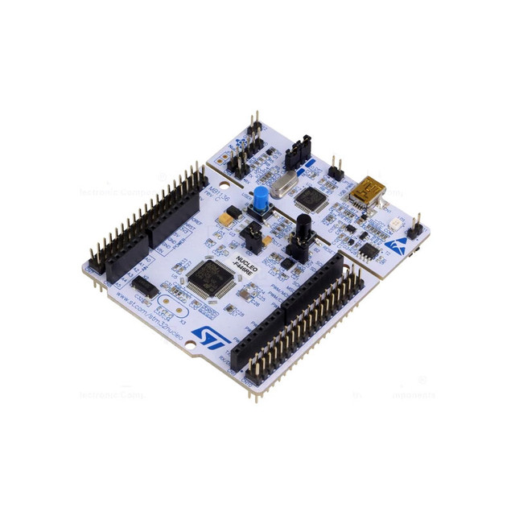

#### SUMMARY
With this repository, I want to demonstrate how to set up a project to program an STM32F446RE board without using STM32CubeIDE. This involves using WSL/WSL2 with Linux (Ubuntu) and VSCode on Windows. Starting with a minimal 'bare-metal' example and gradually adding standard libraries to create a more complex project. I hope this can help you in some way.

#### TOOLS 
- ARM Toolchain (default 13.3)
- WSL/WSL2
- Ubuntu (18.04 to 24.04)
- VsCode

#### I used the STM32F446RE board.
This repository can be adapted to any board in the STM32F4 family.

### Project Stages

| Stage | Description | Link |
|-------|-------------|------|
| Setup Environment | Initial development environment setup. Includes WSL/Ubuntu configuration, installing required tools (ARM toolchain, OpenOCD), and VSCode integration. Essential first step for STM32 development without CubeIDE. | [000_SETUP_ENVIRONMENT](https://github.com/janieblas/STM32F446E_whitout_stm32CubeIDE/tree/main/000_SETUP_ENVIRONMENT) |
| Bare Metal | Basic project setup with minimal code. Includes startup code, linker script, and a simple LED blink example. Shows how to compile and flash without any HAL or libraries. | [001_BARE_METAL](https://github.com/janieblas/STM32F446E_whitout_stm32CubeIDE/tree/main/001_BARE_METAL) |
| CMSIS Integration | Adds ARM CMSIS support for hardware abstraction. Includes proper initialization, register definitions, and standardized peripheral access. Makes code more portable and maintainable. | [002_ADD_CMSIS](https://github.com/janieblas/STM32F446E_whitout_stm32CubeIDE/tree/main/002_ADD_CMSIS) |
| Debugger Setup | Configures debugging support using OpenOCD and GDB. Shows how to set breakpoints, inspect variables, and debug your code in real-time. Essential for development and troubleshooting. | [003_DEBUGGER](https://github.com/janieblas/STM32F446E_whitout_stm32CubeIDE/tree/main/003_DEBUGGER) |

Each stage builds upon the previous one, gradually introducing more functionality while maintaining a clear understanding of the underlying system.

